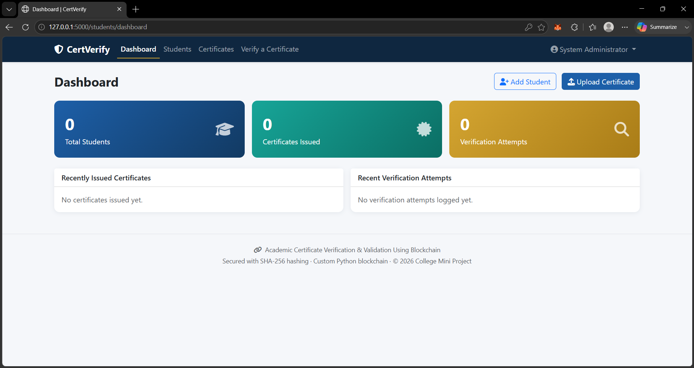
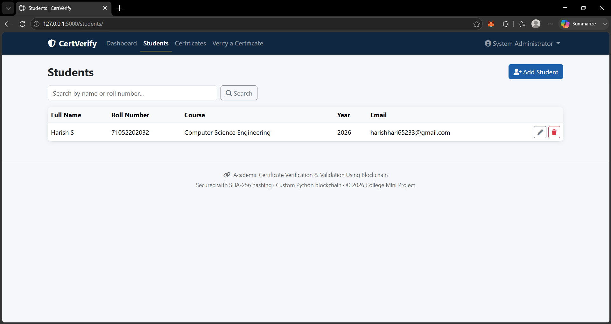
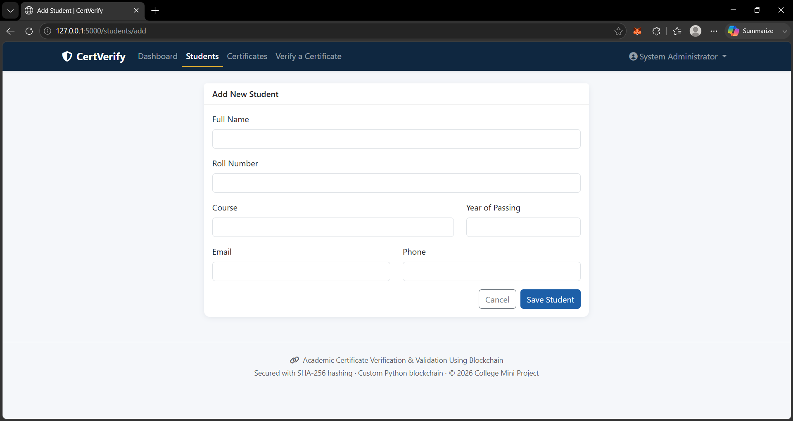
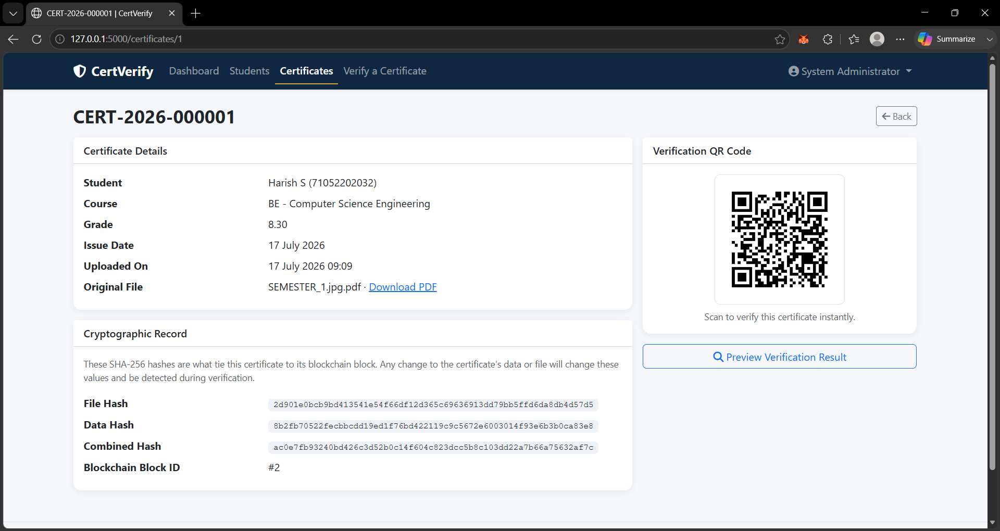
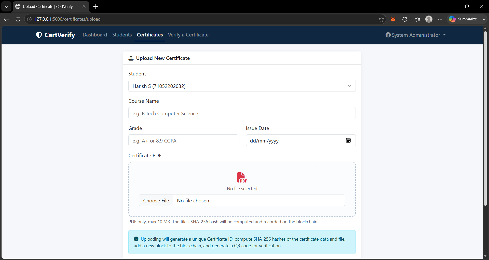
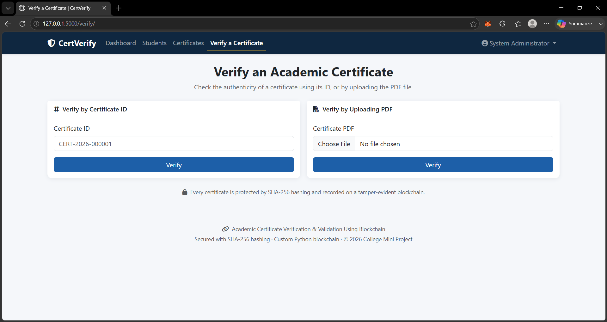
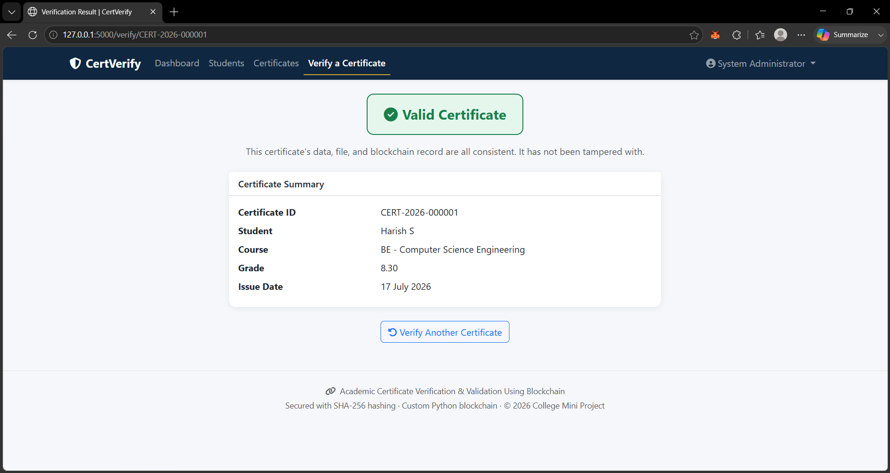

# 🎓 CertVerify Blockchain

A secure Academic Certificate Verification and Validation System built using **Python, Flask, MySQL, and Blockchain**. The system generates a blockchain hash for every uploaded certificate and allows anyone to verify its authenticity using the Certificate ID or PDF file.

---

## 🚀 Features

- 🔐 Admin Login
- 👨‍🎓 Student Management
- 📄 Certificate Upload
- 🔗 Blockchain Hash Generation
- 📋 Certificate ID Generation
- 📱 QR Code Generation
- ✅ Certificate Verification
- 📄 PDF Certificate Verification
- 🛡️ Tampering Detection
- 📊 Dashboard

---

## 🛠️ Technologies Used

- Python 3
- Flask
- MySQL
- HTML5
- CSS3
- JavaScript
- Bootstrap
- Blockchain (SHA-256)
- QR Code

---

## 📂 Project Structure

```
certverify-project/
│
├── app/
├── database/
├── screenshots/
├── tests/
├── requirements.txt
├── run.py
└── README.md
```

---

## ⚙️ Installation

### Clone Repository

```bash
git clone https://github.com/Harishsenthil18/Certverify-blockchain.git
```

### Move into Project

```bash
cd Certverify-blockchain
```

### Create Virtual Environment

```bash
python -m venv venv
```

### Activate Virtual Environment

Windows

```bash
venv\Scripts\activate
```

### Install Requirements

```bash
pip install -r requirements.txt
```

### Configure Database

- Create MySQL Database
- Import `database/schema.sql`
- Import `database/seed_data.sql`

### Run Project

```bash
python run.py
```

---

# 📸 Screenshots

## Dashboard



---

## Students



---

## Add Student



---

## Certificates



---

## Upload Certificate



---

## Verify Certificate



---

## Valid Certificate



---

# 🔐 Blockchain Workflow

1. Upload Certificate
2. Generate SHA-256 Hash
3. Store Hash in Blockchain
4. Generate QR Code
5. Verify Certificate
6. Detect Tampering

---

# 👨‍💻 Author

**Harish Senthil**

GitHub:
https://github.com/Harishsenthil18

---

## ⭐ Project Highlights

- Blockchain-based Certificate Verification
- Secure SHA-256 Hashing
- QR Code Validation
- Flask Web Application
- MySQL Database
- Tamper Detection
- Professional Project Structure

---

## 📜 License

This project is developed for educational purposes.
